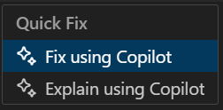
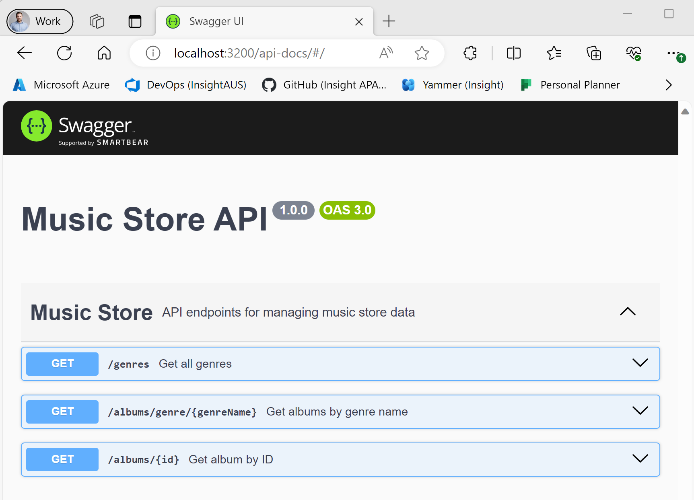

# Step 3: Add Swagger to the Express API

In this step we will use Copilot to add Swagger API documentation to our music store API.

1. Let's begin by opening up our main server file `app.ts` and ask Copilot Chat how we can add Swagger to our Express API project.

2. Follow the steps to add Swagger to the API project, the suggestions should include installing `swagger-jsdoc` & `swagger-ui-express`, adding a Swagger options file and making some changes to your main server file.
> [!NOTE]
> Did you get an error on the import statements for `swagger-jsdoc` or `swagger-ui-express`? 
> Hover over the error, click `Quick Fix...` then click `Fix using Copilot`, see what it suggests to fix the error!<br>
> 

3. Open up your `musicStoreController.ts` file, select the contents of the file using `CTRL + A`, then bring up the Copilot prompt using `CTRL + I`. Type a prompt to generate the `swagger-jsdoc` definitions for your API controller, and if you are happy with the results click `Accept`.
> [!NOTE]
> Check the generated JSDoc route paths match your API routes.

At this point your `musicStoreController.ts` might look similar to this:
```TypeScript
    import { Request, Response } from 'express';
    import MusicService from '../services/musicStoreService';

    /**
    * @swagger
    * tags:
    *   name: Music Store
    *   description: API endpoints for managing music store data
    */

    class MusicStoreController {
        /**
        * @swagger
        * /genres:
        *   get:
        *     summary: Get all genres
        *     tags: [Music Store]
        *     responses:
        *       200:
        *         description: OK
        */
        async getAllGenres(req: Request, res: Response): Promise<void> {
            const genres = MusicService.getAllGenres();
            res.json(genres);
        }

        /**
        * @swagger
        * /albums/genre/{genreName}:
        *   get:
        *     summary: Get albums by genre name
        *     tags: [Music Store]
        *     parameters:
        *       - in: path
        *         name: genreName
        *         required: true
        *         schema:
        *           type: string
        *     responses:
        *       200:
        *         description: OK
        */
        async getAlbumsByGenreName(req: Request, res: Response): Promise<void> {
            const albums = MusicService.getAlbumsByGenreName(req.params.genreName);
            res.json(albums);
        }

        /**
        * @swagger
        * /albums/{id}:
        *   get:
        *     summary: Get album by ID
        *     tags: [Music Store]
        *     parameters:
        *       - in: path
        *         name: id
        *         required: true
        *         schema:
        *           type: integer
        *     responses:
        *       200:
        *         description: OK
        *       404:
        *         description: Album not found
        */
        async getAlbumById(req: Request, res: Response): Promise<void> {
            // Get the album by integer id
            const album = MusicService.getAlbumById(parseInt(req.params.id));
            if (!album) {
                res.status(404).send('Album not found');
            } else {
                res.json(album);
            }
        }
    }

    export default new MusicStoreController();
```

You should now be able to run your API and navigate to the Swagger page in your browser:


## Next Steps?
At this point we have a functioning Music Store REST API, but what changes should we consider before this API could be deployed into production? Open up your `app.ts` file, then ask Copilot Chat for some suggestions! Here are some examples of what to ask:
- What changes would I need to make before deploying this API to production?
- How do I replace my hard coded data with a Azure SQL and a TypeScript ORM? 
- How do I add Azure Application Insights to my API?
- How do I add AzureAD authentication to my API?

> [!NOTE]
> You can try making the above suggestions in your own time, but they are out of scope for this lab.

---------------
[Previous - Extending the Node.js Express TypeScript API](./02-Step02.md) | [Next - Add a Next.js Page & Display Data](./04-Step04.md)