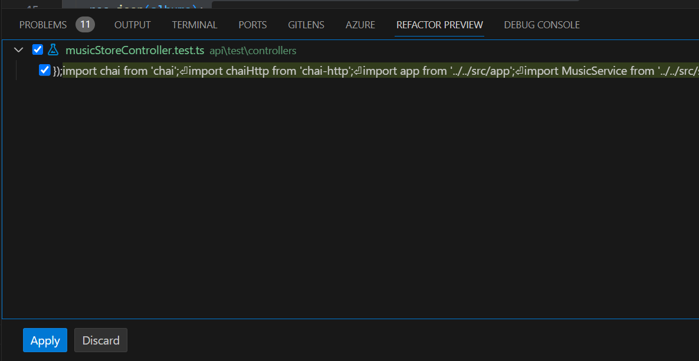
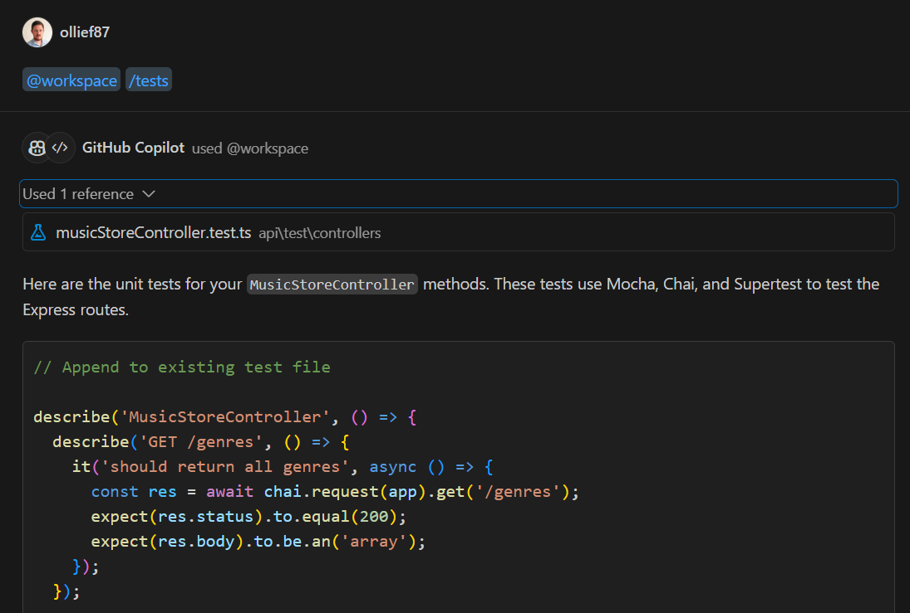
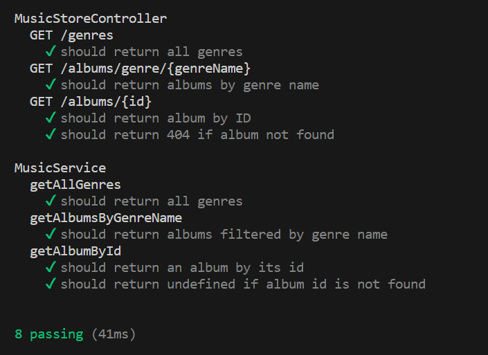

# Step 6: Adding Unit Tests
Now lets use Copilot to add unit tests to both our Express API and our Next.js app.

## Express API
1. Open up the `package.json` file for your Express API, then use Copilot Chat to find out how to add unit tests to your Express API.
2. Copilot should make some suggestions of dev packages to install using `npm install --save-dev ...`, changes to the `package.json` as well as a sample test. Modify the path to the tests based on your project structure, in my case tests are in `test/**/*/*.test.ts`, but tests can also live along side the code they are testing.
3. In your `tests` folder create a folder `controllers` and a folder `services`.
4. In the `controller` folder create a file `musicStoreController.test.ts` and in the `services` folder create a file `musicStoreService.test.ts`.
5. Open up the `musicStoreController.ts` file, press `CTRL + A` to select the contents of the file, then press `CTRL + I`, type the command `/tests` and press `Enter`. You should get a suggestion in the `Refactor Preview` panel with a suggestion of the `musicStoreController.test.ts`, click `Apply`.

Alternatively you can run the same command `/tests` in Copilot Chat with the `musicStoreController.ts` open, you will need to copy & paste the code into your test file.

5. Open up the `musicStoreService.ts` file and repeat the `/tests` command using either `CTRL + I` or Copilot Chat to generate the tests in `musicStoreService.test.ts`.
6. Now run the tests using `npm run test`.

## Next.js App

---------------
[Previous - Refactor your Next.js Pages](./05-Step05.md)