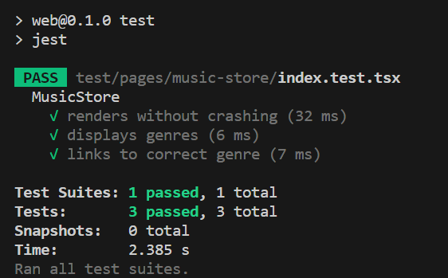
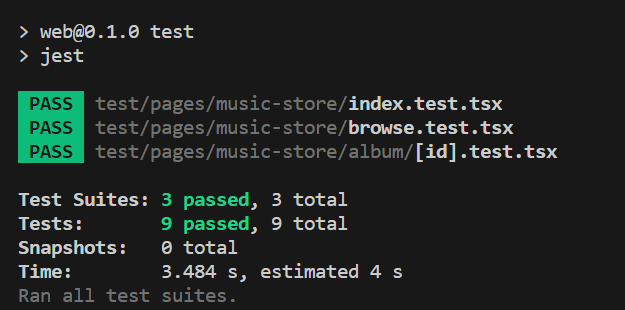

# Step 6: Adding Unit Tests
Now lets use Copilot to add unit tests to both our Express API and our Next.js app.

## Express API
1. Open up the `package.json` file for your Express API, then use Copilot Chat to find out how to add unit tests to your Express API.
2. Copilot should make some suggestions of dev packages to install using `npm install --save-dev ...`, changes to the `package.json` as well as a sample test. Modify the path to the tests based on your project structure, in my case tests are in `test/**/*/*.test.ts`, but tests can also live along side the code they are testing.
3. In your `tests` folder create a folder `controllers` and a folder `services`.
4. In the `controller` folder create a file `musicStoreController.test.ts` and in the `services` folder create a file `musicStoreService.test.ts`.
5. Open up the `musicStoreController.ts` file, press `CTRL + A` to select the contents of the file, then press `CTRL + I`, type the command `/tests` and press `Enter`. You should get a suggestion in the `Refactor Preview` panel with a suggestion of the `musicStoreController.test.ts`, click `Apply`.

Alternatively you can run the same command `/tests` in Copilot Chat with the `musicStoreController.ts` open, you will need to copy & paste the code into your test file.

5. Open up the `musicStoreService.ts` file and repeat the `/tests` command using either `CTRL + I` or Copilot Chat to generate the tests in `musicStoreService.test.ts`.
6. Now run the tests using `npm run test`.


## Next.js App
1. Open up the `package.json` file for your Next.js App, then use Copilot Chat to find out how to add unit tests to your Next.js App.
2. Copilot should make some suggestions of dev packages to install using `npm install --save-dev ...`, `.babelrc` file, `jest.config.js` file, `setupTests.js`, changes to the `package.json` as well as a sample test. 
> [!NOTE]
> ESLint might complain about your Jest config files, modify the `.eslintrc.json` file like below:
> ```json
>{
>   "extends": ["@babel/preset-typescript", "next/core-web-vitals"]
>}
> ```
> You might also get an error `Property 'toBeInTheDocument' does not exist on type 'JestMatchers<HTMLElement>'` in your tests, to resolve this add the following line to your `tsconfig.json` under `compilerOptions`:
> ```javascript
>{
>   "compilerOptions": {
>      // ... other options
>      "types": ["@testing-library/jest-dom"],
>      // ... other options
>   }
>}
> ```
> It's also likely you will get an error `Cannot find module '@testing-library/jest-dom/extend-expect' from 'setupTests.js'`, change your `setupTests.js` to import `import '@testing-library/jest-dom';` instead of `@testing-library/jest-dom/extend-expect;`
>
> For Jest >28 jsdom is no longer included by default, run the command `npm install --save-dev jest-environment-jsdom` to install it then update your `jest.config.js` to set it as the test environment:
>```javascript
>module.exports = {
>   testEnvironment: 'jsdom'
>   // ... other options
>};
>```
> That's it I promise! At the time of writing this lab, the suggestions from Copilot don't match recent breaking changes in Next.js & Jest.
3. In the root of your Next.js App create a folder `test`, in that folder create another folder `pages` and within that folder create a folder `music-store`.
4. In the `music-store` folder create a file named `index.test.tsx`.
5. Like in the step above open the `index.tsx` file and repeat the `/tests` command using either `CTRL + I` or Copilot Chat to generate the tests in `index.test.tsx`. Fix any `import` references that are incorrect.
6. Now run the tests using `npm run test`.<br>

7. Repeat steps 4 & 5 creating tests `browse.test.tsx` & `album/[id].test.tsx`.
8. Now run the tests again and you should have test suites for all three pages.


---------------
[Previous - Refactor your Next.js Pages](./05-Step05.md) | [Next - Wrapping things up](./Finish.md)